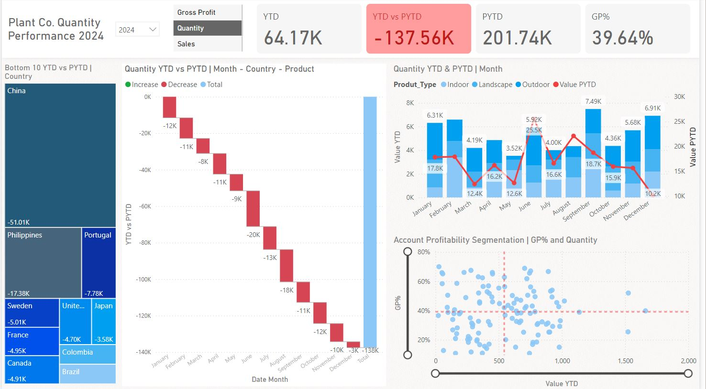

# Plant Co. Quantity Performance 2024 - Sales Analysis Dashboard

This repository contains a Power BI dashboard designed to analyze and visualize the quantity performance of Plant Co. for the year 2024. The dashboard provides insights into year-to-date (YTD) sales, gross profit percentage (GP%), and the variance between YTD and the previous year's same time period (PYTD).

 

## Dashboard Overview

### Key Metrics:
- **YTD (Year-to-Date)**: Displays the total quantity sold up to the current date in 2024.
- **PYTD (Previous Year-to-Date)**: Shows the total quantity sold up to the same date in the previous year.
- **YTD vs PYTD**: Highlights the difference between the current year's YTD and the previous year's PYTD.
- **GP% (Gross Profit Percentage)**: Indicates the gross profit percentage for the current period.

### Visualizations:
1. **Bottom 10 YTD vs PYTD | Country**: Tree map displaying the bottom 10 countries by the decline in quantity sold when comparing YTD to PYTD.
2. **Quantity YTD vs PYTD | Month - Country - Product**: Waterfall chart showing the monthly changes in quantity sold across different countries and products.
3. **Quantity YTD & PYTD | Month**: Combination chart illustrating monthly sales trends and product type contributions over YTD and PYTD.
4. **Account Profitability Segmentation | GP% and Quantity**: Scatter plot segmenting accounts based on their profitability (GP%) and the quantity sold, providing insights into high-performing accounts and areas for improvement.

## How to Use

1. **Clone the Repository**:
   ```bash
   git clone https://github.com/your-username/sales-analysis-dashboard.git
